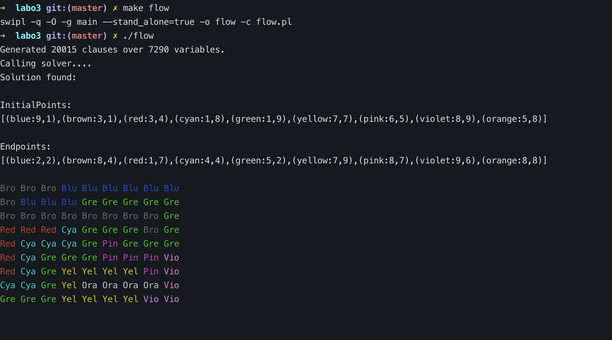

# FlowFreeSolver
[](http://commonmark.org)[](https://GitHub.com/adriacabeza/FlowFreeSolver/stargazers/)

Flow Free is a puzzle game that consists in pairing all colors and cover the entire board. Remember that no empty cells can be left, there can not be intersecting or non-finished paths.

<p align="center">

</p>


 This solution consists in writing all the restrictions as a SAT problem using Prolog, letting **picosat** (SAT solver) solve it and then retrieving the model to display the solution. 

### Input
The input structure is the following:
```prolog
% size of the grid
size(9).
% initial points
c(blue,  9,1,2,2).
c(brown, 3,1,8,4).
c(red,   3,4,1,7).
c(cyan,  1,8,4,4).
c(green, 1,9,5,2).
c(yellow,7,7,7,9).
c(pink,  6,5,8,7).
c(violet,8,9,9,6).
c(orange,5,8,8,8).
```

### Output
From the previous input, we would get the following output:



## Usage
To use it, remember to change the input problem to the one desired ot solve, compile it using the Makefile and then run the executable to see the solution:
1- Change this line from *flow.pl*:
```prolog
:-include(NAMEOFINPUT).
```
2- Compile and run it:
```bash
make flow
./flow
```

### Requirements

In the case that you do not want to install any Prolog programming environment, like SWI-Prolog, you can use the Dockerfile:

```
docker build -t prolog . &&
docker run -it -d -v PATH_TO_REPOSITORY:/workspace prolog &&
docker exec -it name_of_container zsh
swipl
```
